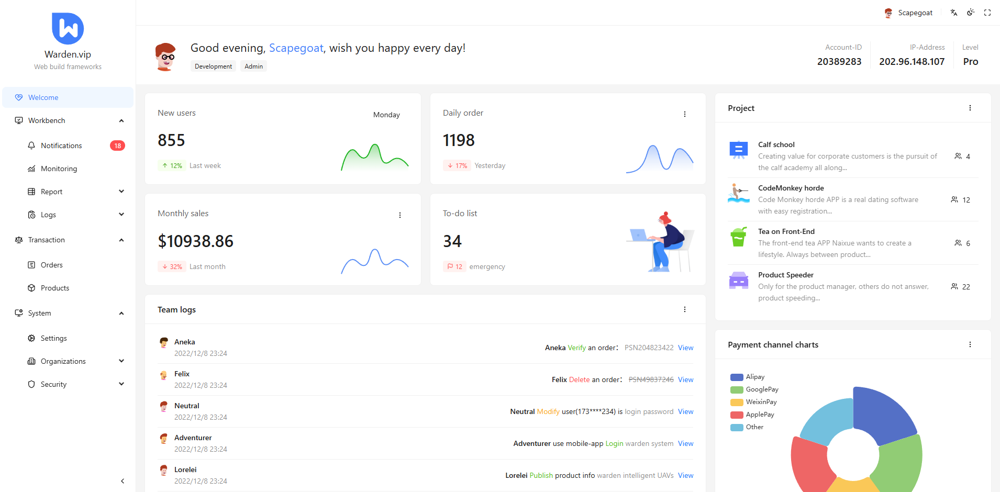

<div align="center"><a name="readme-top"></a>
  


<h1>adminui-antd-layout</h1>

这是一个基于Antd的布局组件

English · [中文](./README-zh_CN.md)
## ❤️ 支持多种布局样式和自定义主题皮肤，支持多种路由且脱离UMI控制，细节控。



</div>

## ✨ 特性

- 🌈 统一中后台交互体验和风格。
- 📦 开箱即用集成丰富的模版。
- ⚙️ 配套细节控制组件可插拔。
- 🌍 支持国际化。
- 🎨 支持更深度的主题定制。

## 📦 安装

```bash
npm install @adminui-dev/antd-layout --save
```

```bash
yarn add @adminui-dev/antd-layout
```

```bash
pnpm add @adminui-dev/antd-layout
```

```bash
bun add @adminui-dev/antd-layout
```
## 📦 安装依赖
```json
"@ant-design/colors": "^7.2.1",
"antd": "^6.1.1",
"dayjs": "^1.11.19",
"nprogress": "^0.2.0",
"react": "^19.2.0",
"react-dom": "^19.2.0",
"react-intl": "^8.0.4",
"react-router": "^7.11.0",
"react-router-dom": "^7.11.0"
```

## 🚀 或者使用 npx create-antd-layout 快速模版构建（推荐）
```bash
npx create-antd-layout@lastest your-app
```
